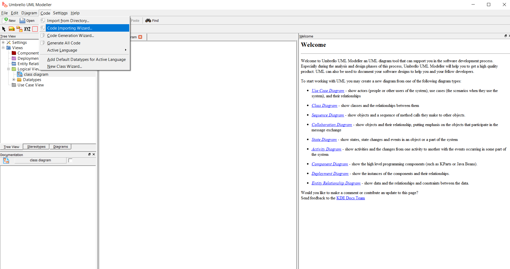
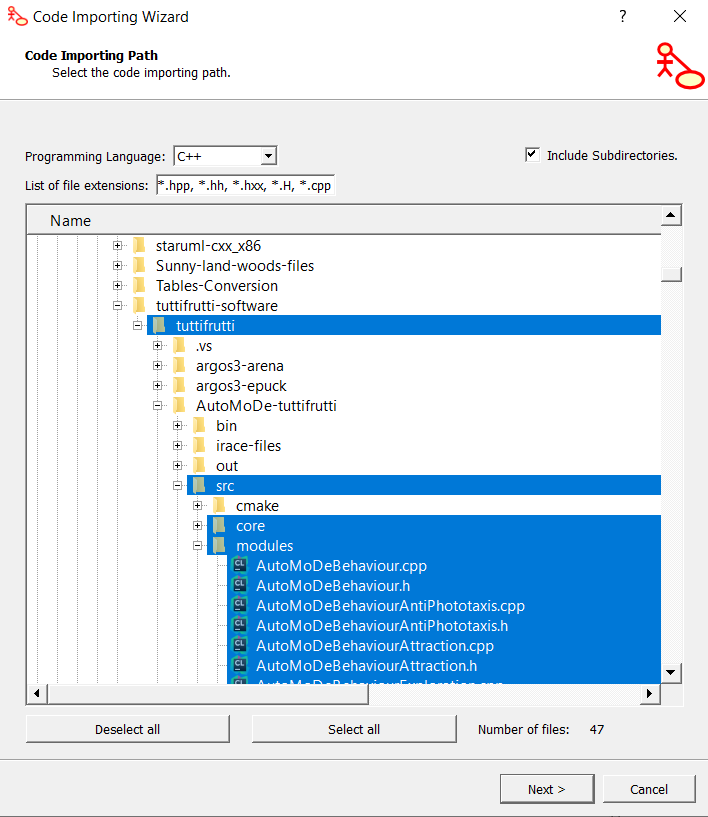
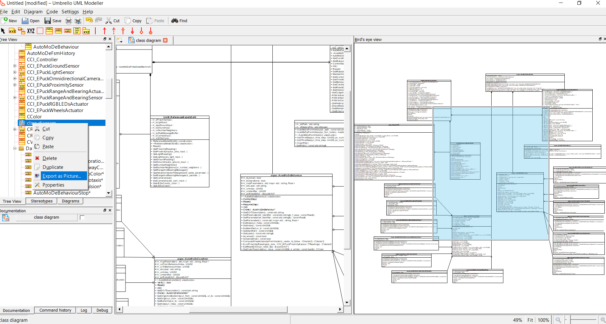
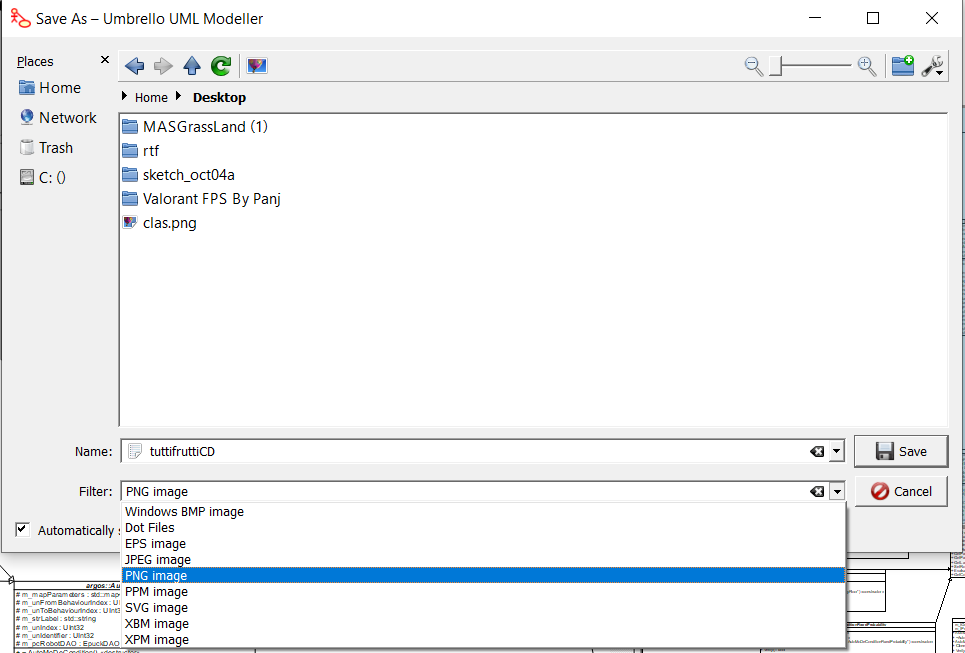

# How to make a class diagram from C++ codes

1. Download [Umbrello](https://umbrello.kde.org/installation.php).
   This software allows to reverse enginneer c++ codes to class diagram automatically.

2. When you finished the download you can install it

3. Once installed you can open it and click on _code importing wizard..._ located in the _code_ menu.

4. It will open a file browser where you can select all classes that you want to be part of your class diagram.

5. When you imported all classes you can see them in the _Three view_ on the top left. Moreover, you can also find a _class diagram_ component. If you double click on this component you can modify the style to a black and white style for a better look.

6. If you are in the _class diagram_ you can add classes in your class diagram. If there are links, extends, aggregations,... that you want add, you can do it using the corresponding tools on the top. Moreover, you can delete them if you want using _left-click_ then _delete_ on your keyboard. And finally another interesting feature is that you can modify easily attributes and methods that are in classes by _double-clicking_ on the class.

7. When you finished your design and you want to export an image, _right-click_ on _class diagram_ and select _Export as picture..._

8. Take care to change the format of your exportation

