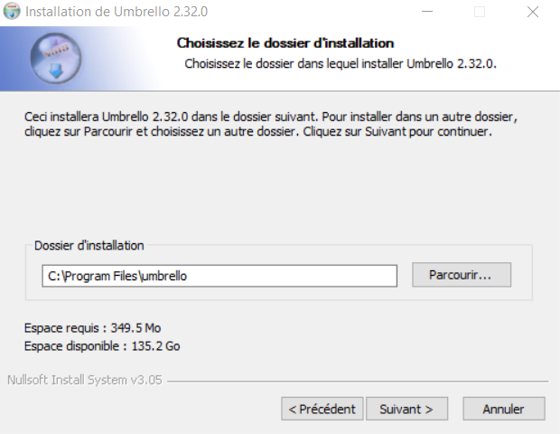
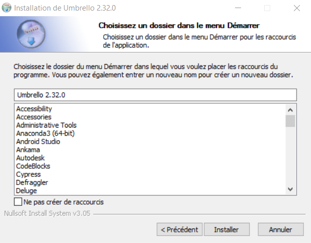

# How to make a class diagram from C++ codes

1. Download [Umbrello](https://umbrello.kde.org/installation.php).
   This software allows to reverse enginneer c++ to class diagram automaticly.
2. When you finished the download you can install it

