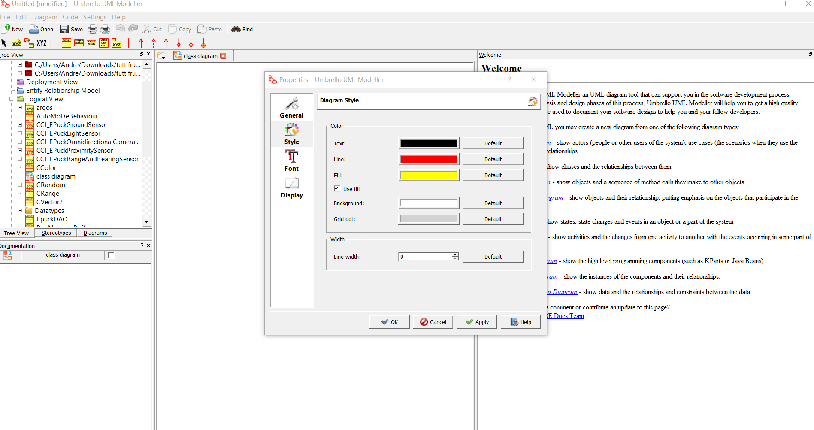

# How to make a class diagram from C++ codes

1. Download [Umbrello](https://umbrello.kde.org/installation.php).
   This software allows to reverse enginneer c++ to class diagram automaticly.
2. When you finished the download you can install it

3. Once installed you can open it and click on _code importing wizard..._ located in the _code_ menu.

4. It will open a file browser where you can select all classes that you want to be part of your class diagram.

5. When you imported all classes you can see them in the _Three view_ on the top left. Moreover, you can also find a _class diagram_ component. If you double click on this component you can modify the style to a black and white style for a better look.

